if you successfully [installed anvio](https://zetazee.github.io/anvio/installation.html), you can proceed from here.

anvio visualizations look like this:
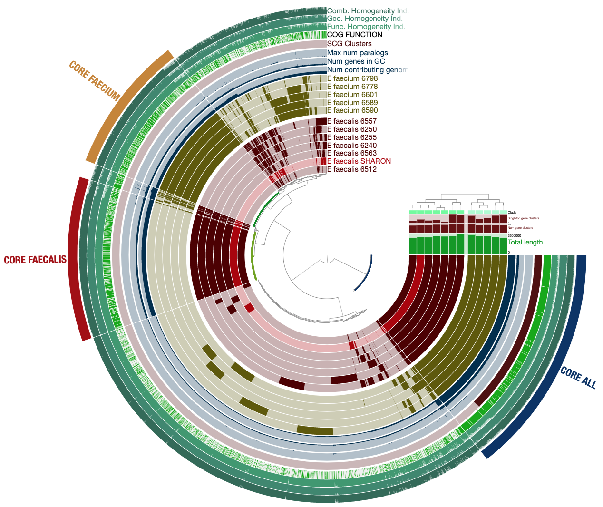

when you learn to generate it, you can interact with it by hovering your mouse over each part to see more information. 
now we need to check if this interactive command works correctly, even though we don’t have any data or files to visualize yet. we actually need some files with the `.db` extension, but that’s okay—we’ll fake some. we’ll enter this code and expect to get an error saying the files don’t exist, which confirms that `anvi-interactive` works perfectly. however, if we get another message related to the interactive part, we’ll fix that.  
```bash
anvi-interactive -c CONTIGS.db -p MERGED/PROFILE.db -I localhost
```
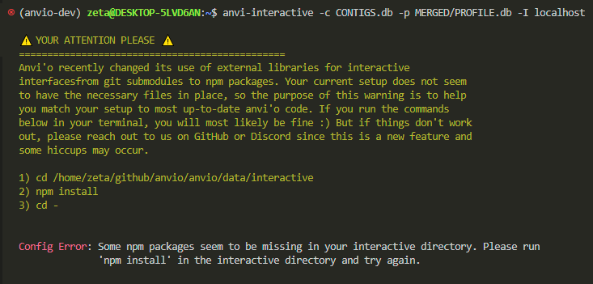

i got the nicest error message, explaining in plain language how to fix the problem. so, i need to set my path correctly, install something called `npm`, and then run `cd -`.  

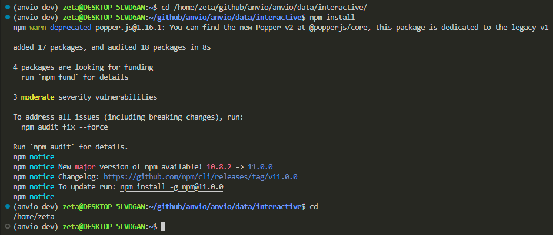

let’s run anvio interactive with our fake files again:

```bash
anvi-interactive -c CONTIGS.db -p MERGED/PROFILE.db -I localhost
```

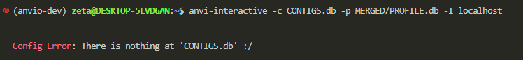

now we got the correct error saying there’s no data in your system yet.  
now, let’s ask anvio to do a full self-test:  

```bash
anvi-self-test --suite mini
```

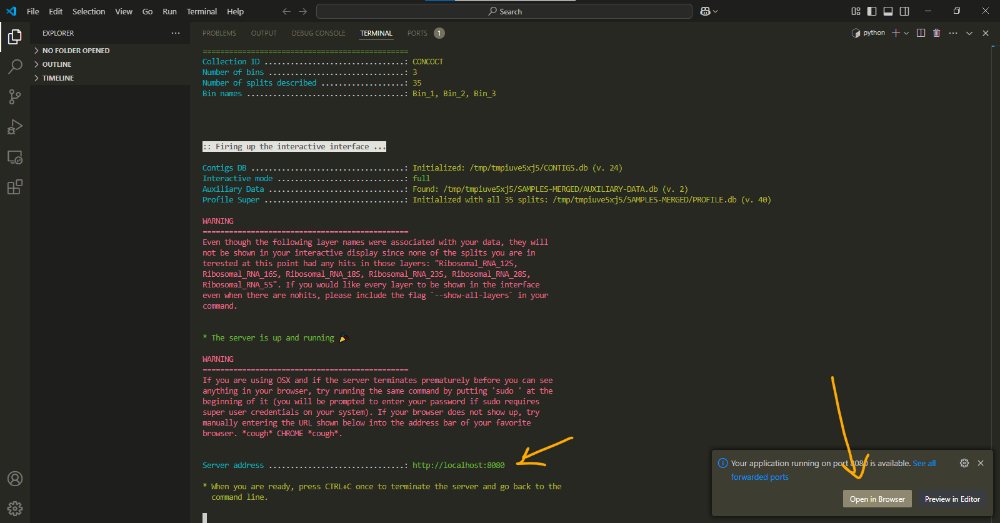

this test will show us how a real `anvi-interactive` works. by opening your localhost in the browser, you can see the newest version and a visualization.

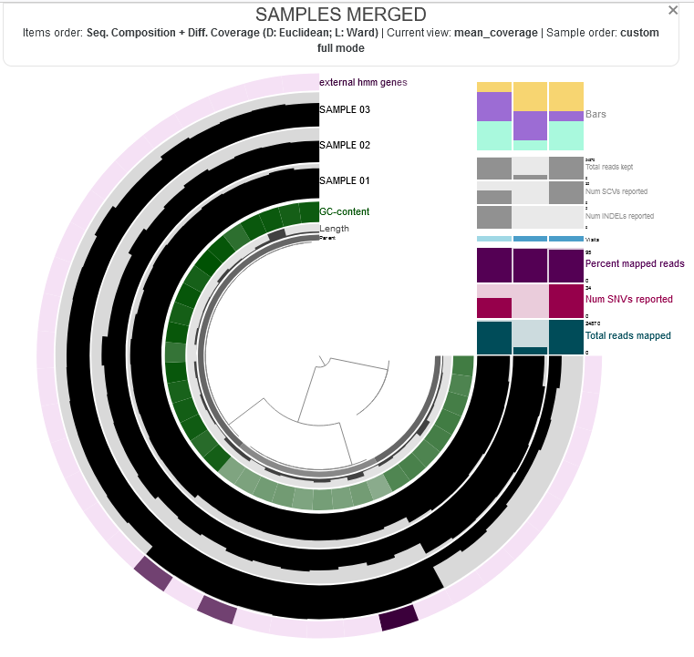

localhost is a url generated on your system to view visualizations. it can have either of these addresses:  
>http://localhost:8080/

>http://127.0.0.1:8080/

anvio visualizations work best with chrome. so, if you notice any weirdness, try opening the url in chrome.  

also, kudos to whoever is naming the versions. 🎉  

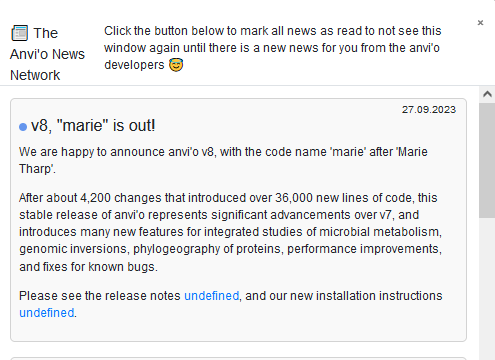


# finalize and prepare for everything

we know that not all parts of a genome are translated into proteins. there are specialized tools that help identify the functional regions of a genome and tag them with their taxonomical or functional roles. anvio allows us to integrate these tools and databases.  

let’s go:  

```bash
anvi-setup-scg-taxonomy
```
it took me less than a minute with the university internet nework, it might vary for you.  
(i’ll mention the time it took me for a relative comparison.)

```bash
anvi-setup-ncbi-cogs
```
6 minutes

```bash
anvi-setup-kegg-data
```
14 minutes

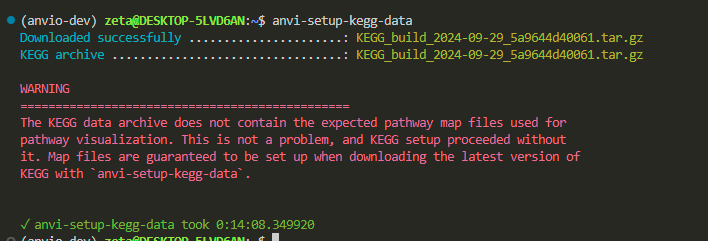

now do another test:
```bash
anvi-self-test --suite pangenomics
```

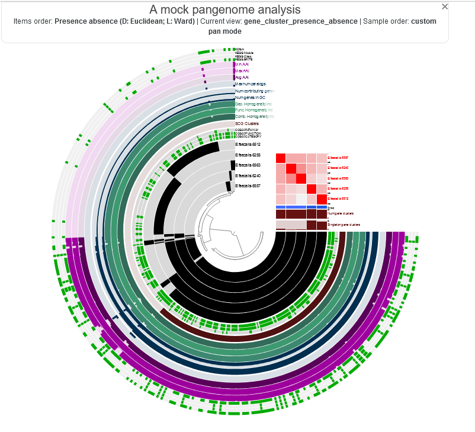


i seem to be safe. how is it going for you over there? :)

# binning algorithm
you will learn what binning means during the course, but for now, we’ll just set up the necessary tools for it.  
move to the `github` directory: 

```bash
cd ~/github/
```

clone CONCOT to anvio conda enviornment:
(run each line separately)
```bash
git clone https://github.com/merenlab/CONCOCT.git
```
```bash
cd CONCOCT
````
```bash
python setup.py build
```

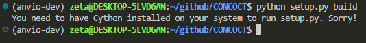

i need `cython`. i don’t know what it is either, but let’s go ahead and figure out how to install it anyway.  
```bash
conda install -c conda-forge cython
```
```bash
cython --version
```

re-run:
```bash
python setup.py build
```
```bash
python setup.py install
```

finished! now we run this command to see a page like this:

```bash
anvi-cluster-contigs -h
```

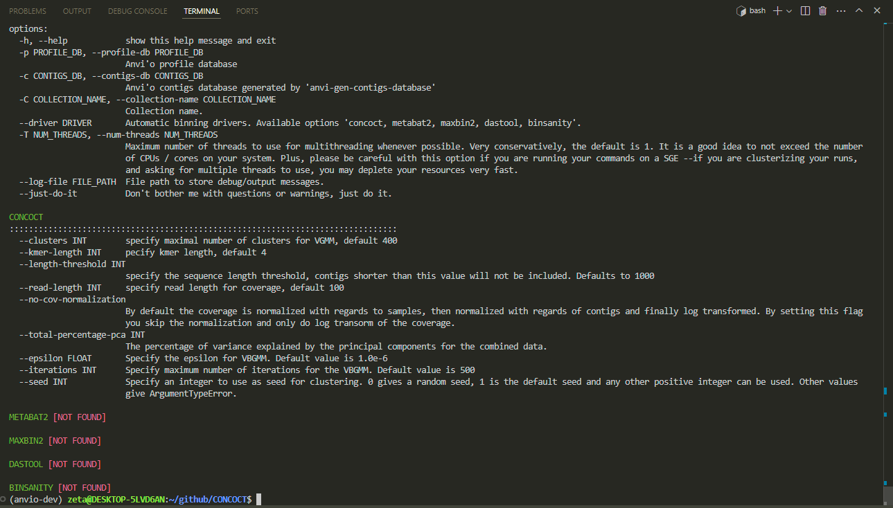

we can go for a cup of tea now :D  


