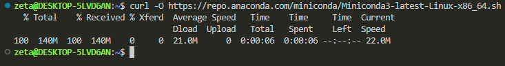

# what is anvio

it is a tool that turns solid, random-looking data into clear visuals that you can understand. you can think of it as a translator, not just any translator, but one that knows many languages and shows information in a way that is easy to see and work with. 

at first, it might seem quite complicated, but it’s actually just a tool, and like any tool, you can learn how to use it. you don’t need to learn all of its features right away. you’ll start with the basic, important ones, and if you need more advanced features in the future, you can learn them as you go.

# before installation: optimize your system and set your mindset
anvio does many things, which is why installing it requires more time than a regular program where we only need to hit next repeatedly. It’s okay, take your time and do it right. if the installation goes right, things will go much more smoothly for you later. so, get ready for an installation that is different from what you are usually used to and carefully peruse the instructions. perusing means reading in detail, not skimming. we are biologists with probably very little experience with computers. in this course, you can work on your computer skills and expand your skill set. rule number 1 for doing that is to read the instructions (documentation) word by word, then it’s just copy and paste.

my installation is for windows 10, 64-bit, core i5 system with no gpu, and i have 200 gb free space on my C folder. anvio is very resource-intensive, and you need to optimize your laptop before installing.
- in my opinion, core i5 is the minimum, and if your system has less cpu power, you can ask [ASTA](https://asta-oldenburg.de/angebote/computerwerkstatt/) to borrow a laptop for the duration of the course.  
- if you have less than 50 gb free space, you can easily insert a new ssd, it’s not hard to do on your own. buy a new ssd and search online for how to install it. once done, install windows Enterprise on it because it’s much faster than the Home version (just between us, you can also find the enterprise version for free online, torrent, cough cough). i should mention that 30 gb would also do, but being so close to the system's limit will slow your computer down and make your life harder.
make sure everything is set for the best performance. this way, you can be sure that if something goes wrong, it’s your fault and not the system’s, making it much easier to troubleshoot. when your system starts acting up, it can be frustrating to pinpoint the issue.
by the way, if you choose to install windows enterprise, connect it to your windows account for recovery if needed. sometimes, changes in your ip or network can lock you out, and without a backup, you could lose all your files.  

# WSL and VS Code
there is a windows-like operating system named Linux that gives you more freedom in customization and using different tools. many applications, especially in bioinformatics, are written in a way that requires linux. for this course, you can either [set up a dual system](https://www.youtube.com/watch?v=GXxTxBPKecQ) by installing linux alongside your windows (takes a maximum of one hour) or install a small version of linux inside your windows (takes about 5 minutes). i recommend the latter, not only because it saves time but also for better compatibility.  

windows is designed to work seamlessly if you stick to tools specifically made for it. that’s why i installed wsl (windows subsystem for linux) and connected it to a program called VS Code, which is also built for windows. with this setup, i can access my linux terminal through vs code. you can ask chatgpt how to install wsl and how to access it remotely via vs code. once done, you’ll see something like this and can move on to the next step.


# installing Anvio
we have two options for installing anvio: stable version and development version. we will choose to [install the development version](https://anvio.org/install/windows/dev/), not only because we are adults now :)) but also because it is actively being developed and fixed. if something during the course needs to be addressed, you will automatically have the updated version without needing to do anything actively. let's start.

# 1. check to see if you have this software named miniconda.
what is miniconda? we don't know, yet. most of the time, you don’t need to know what these software are or what they exactly do, here. FOR NOW let's agree that we just need to have them to install anvio. of course, you can always search to learn more about them. you will encounter many of these oddly named software tools that are interdependent and necessary for specific tasks, but they are not our focus in this course. we will be satisfied knowing that they are helping us get to anvio.

so copy paste this in your wsl terminal inside VS Code:
```bash
conda --version
```


if it says `command not found`, you don’t have it, and you need to install it.

# 2. install miniconda:

from [this page](https://docs.anaconda.com/miniconda/install/), you can choose your system and install it. just remember that your system’s name is now linux (not windows anymore), and we need to follow linux-specific installations. we are going to be working only with wsl during the course.

the documentation for linux says we need to download it by copying and pasting this line into the terminal:
```bash
curl -O https://repo.anaconda.com/miniconda/Miniconda3-latest-Linux-x86_64.sh
```



i didn’t get any errors, but you might see that you don’t have this other software named `curl`, and you need to install that before installing miniconda. anytime you don’t have something, just go to its original website, find the command provided for linux, and paste it.

let's verify the download by listing:
```bash
ls
```


you should have a file named `Miniconda3-latest-Linux-x86_64.sh`, like the screenshot. (other files in my computer are irrelevant to this process.)

now we have downloaded the file, but we still don’t have the miniconda software on our system. remember that if this were a windows software, we would have clicked on a download link to get a file with a `.exe` extension, then double-clicked on it to run and install the software. this process is similar. we downloaded the executable file, and now we need to ask `bash` to run it for us because we can’t double-click on files in linux:  

```bash
bash Miniconda3-latest-Linux-x86_64.sh
```


then it will be like installing something in windows, where you click "next" and "yes."  
at the end of the installation, you should see that it has been installed like this:  


now you need to restart your terminal. close vs code and open it again.

verify:
```bash
conda --version
```


still not found. so i need to check if the file is on my linux or not: 
```bash
ls
```


yes, there is a file for `miniconda3`. we can also see the inside of it (like browsing to your c folder) by saying "change directory":  
```bash
cd miniconda3/
```
and then list:
```bash
ls
```


okay, everything needed for it is installed. why doesn’t it recognize it?  
it should be inside the `bin` file, and it is, but my system can’t access it: 


our system doesn’t have an eye to see things, so we need to give it access to files and specify in detail where to find them. this specification of where things are is called `PATH` in linux. it’s analogous to moving your mouse to drive D and selecting something, but here you don’t use a mouse—you type commands. you say, "okay, first open the file explorer, then go to folder D, then execute (like double-clicking) file X."
you will likely encounter many errors during this course caused by `PATH`. so **always check your path first.** if you rule it out, then you can doubt other things.  

- check your path (print working directory):
```bash
pwd
```
this will tell you where you are (which folder you are in now):  


my system’s name is zeta, so it shows `/home/zeta`. yours will show the name you have chosen. this is called `home` in linux. it’s like opening the file explorer and being able to see all the folders (c, d, etc).  

now check the path:
```bash
echo $PATH
```


things will only execute if they are accessible from the path, and i can’t see `/home/zeta/miniconda3/bin`, so we need to add it to the path, according to chatgpt. (you might encounter this error, or you might not. i’m trying to show how you can solve problems you face at any step, they’re pretty much the same. you check the path or the version and always consult chatgpt. you’ll be able to solve the problem.)

Let’s add miniconda bin to the path:
```bash
nano ~/.bashrc
```

when you run this, a new page will open with many things written in it. use your down arrow to scroll to the end of the text and paste this line AFTER adjusting your own username instead of `zeta`:  
```bash
export PATH="/home/zeta/miniconda3/bin:$PATH"
```


do you see `^O` at the bottom of the page? `^` means ctrl here. press `ctrl` and `o`, then it will ask if you want to save it with the same name—we want that, so press `enter`. after that, press `ctrl` and `x` to exit (it says at the bottom of the page that it is for exit).

then run:
```bash
source ~/.bashrc
```
and check to see if `conda` is now accessible by your computer:  
```bash
conda --version
```


voila! we solved a problem. this is where i go for a cup of tea.  
this troubleshooting took me more than an hour. the time you spend now will save you later. spend as much time as it takes—each time it gets easier, and problems get solved by applying previous solutions.

> i assume this is the very first time you are installing anvio, so i will skip the recommendation on the anvio install page that says you should make sure you are not in any environment or don’t have an environment named `anvio-dev`. if this is your second, third, fourth, or fifth time :D, then please take care of those steps before proceeding.

# 3. create a place only for Anvio
anvio works with many different software and programs, and these programs have different versions. we need to make sure they are compatible and can interact with each other properly. to achieve this, we create something like a folder (called an environment) specifically for anvio, where we specify what version of each software to install. this way, if something doesn’t work, we know which version caused the issue and only change that specific version instead of everything.  
for example, the latest version of python at the moment of writing this is 3.12, but we want to work with version 3.10. we can specify this in our anvio environment.  

so, please copy paste this in your terminal:
```bash
conda create -y --name anvio-dev python=3.10
```


we created it, and now we need to **enter** this environment to build things:  

```bash
conda activate anvio-dev
```


it says you have created it but haven’t initialized it yet, so we do that:  
```bash
conda init
```


it also tells me to close and re-open my terminal. (remember, we need to follow every instruction we see to do things right.)  


when i re-open, i realize it says `(base)`, which wasn’t there before. this suggests that we now have more than one environment, and my terminal is indicating that i am not in the default environment or my anvio environment.  

how do i go inside my anvio environment? i ask `conda` to activate that environment for me:  
```bash
conda activate anvio-dev
```


okay, now we have a clean and fresh environment waiting to be occupied.  

# 4. install many software all at once
in the anvio page, we see a paragraph containing six lines of code separated by `\` from each other, which can be executed all at once.  

it will probably work if you just copy and paste it. **but**, as a beginner, i prefer to execute each line individually, troubleshoot if necessary, and then move on to the next line. so let’s do that here.  


copy each code, wait for it to run, then move on to the next:  
```bash
conda install -y -c conda-forge -c bioconda python=3.10
```
```bash
conda install -y -c conda-forge -c bioconda sqlite prodigal idba mcl muscle=3.8.1551 famsa hmmer diamond
```
```bash
conda install -y -c conda-forge -c bioconda blast megahit spades bowtie2 bwa graphviz "samtools>=1.9"
```
```bash
conda install -y -c conda-forge -c bioconda trimal iqtree trnascan-se fasttree vmatch r-base r-tidyverse
```
```bash
conda install -y -c conda-forge -c bioconda r-optparse r-stringi r-magrittr bioconductor-qvalue meme ghostscript
```
```bash
conda install -y -c conda-forge -c bioconda nodejs
```

all of them ran smoothly for me. you should wait until you see something like this after running each line.  


also, if you forgot which line you entered, press the up arrow on your keyboard, and the latest command will appear. 

# 5. install anvio itself
now we have everything that anvio needs to be installed.  
let’s make a directory (a folder) inside our anvio environment to download the files from a website called github, where the anvio code has been shared, into this folder.  
```bash
mkdir -p ~/github && cd ~/github/
```


this command has created a folder named `github` and opened it. the blue text indicates that we are inside this directory.  

now we can copy (clone) anvio’s code to our directory by running this:  
```bash
git clone --recursive https://github.com/merenlab/anvio.git
```


next we move inside the anvio directory:


and run this code to install somethings that our python needs to be working properly:
```bash
pip install -r requirements.txt
```
everything ran smoothly, except for some errors I encountered:  


let’s update our wsl to see if it fixes it:  
(remember that when you type your password in wsl, nothing will appear, but it is being typed. don’t feel confused.)  
```bash
sudo apt update
```
```bash
sudo apt full-upgrade
```
```bash
sudo apt install gcc
```
we run the code again to see if the problem is solved:  
```bash
pip install -r requirements.txt
```
no errors this time, and we now have a nice and complete version of anvio on our system.  


