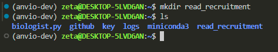
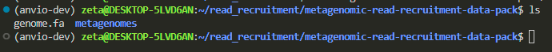
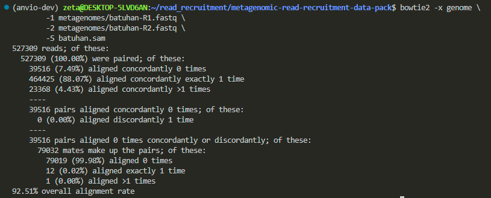
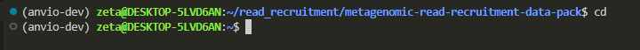
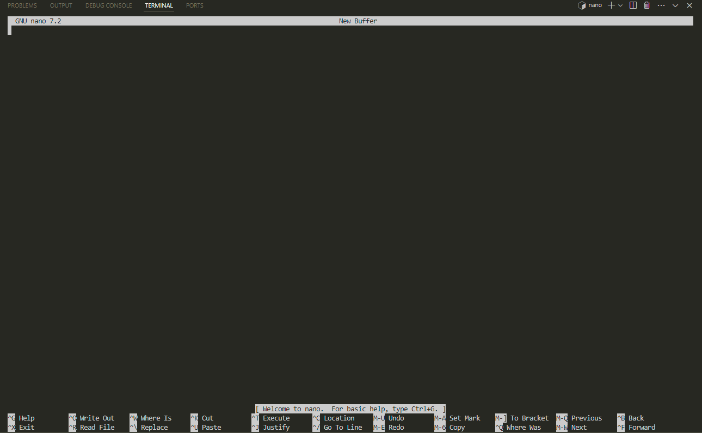
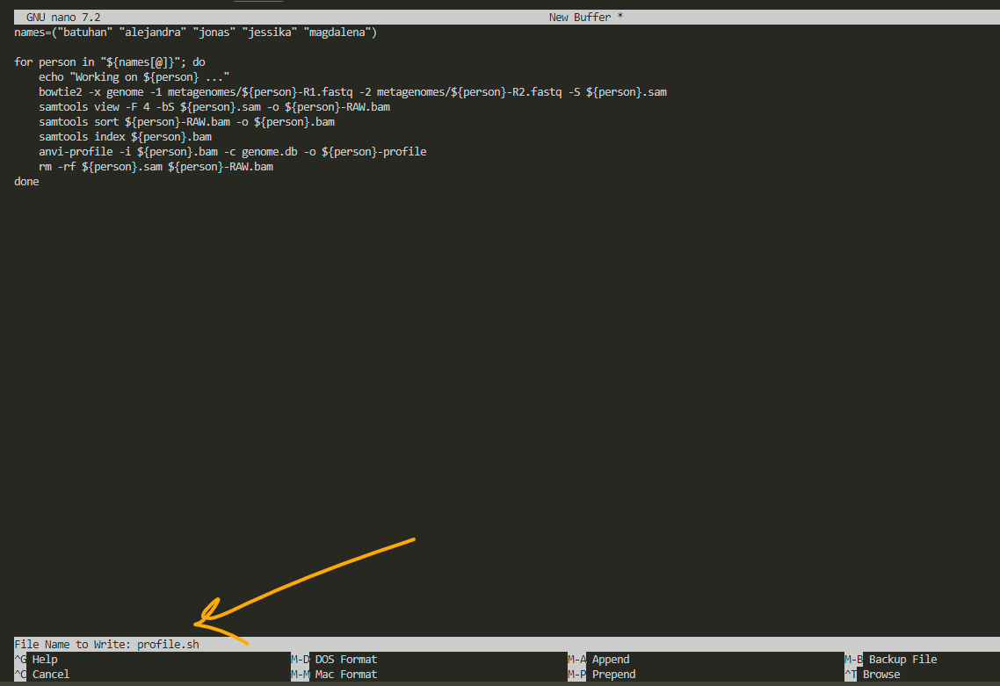
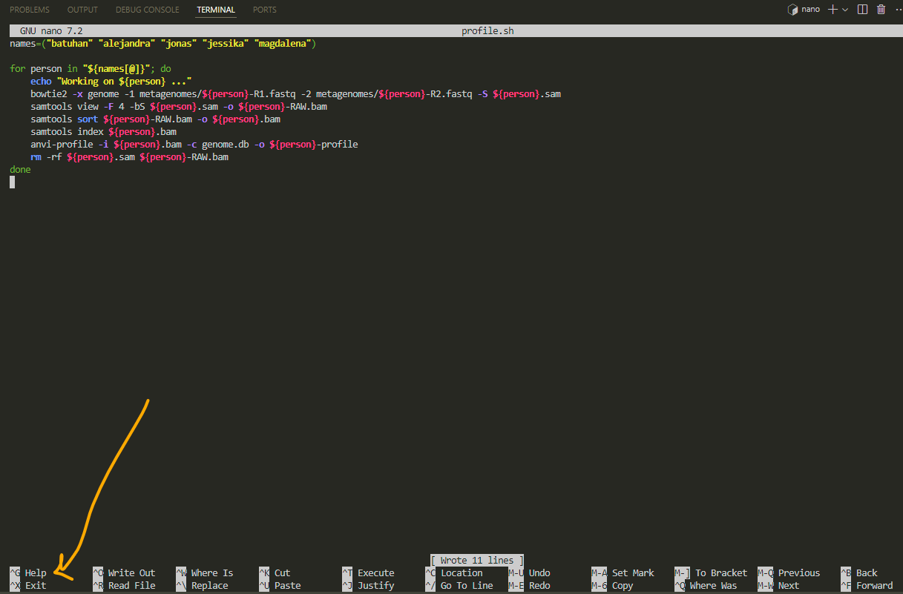
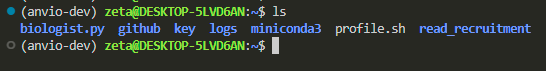

in this tutorial we are working with:
- **reference**: one genome
- **metagenome**: five sets of metagenomes gathered by five different people

if you are not exactly sure what reference and metagenomes are please visit the [read recruitment glossary](https://zetazee.github.io/anvio/read_recruitment_glossary.html) before continuing.

and we are basically doing two simple things here:
- converting some files to each other.
- visualizing them.

some steps could take so long and we could lose track of what we were doing in the first place. but remember we are doing basic conversions and data visualization.

**always remember that you need to run the commands where your files are.**  

if you leave in the middle of the procedure and want to continue later, always `cd` to the directory where your files are before continuing. this may sound obvious, but it’s easy to forget. when you run a command, it needs direct access to the file, it can’t search your entire computer for the file with that specific name.

let's start.

# 1. download the data
we need to download our reference and metagenomes. so let's do that.

but first we ask conda to activate our anvio environment:


then for being organized and clean, let’s create a directory for read recruitment and keep everything related to it there (we are **m**a**k**ing a **dir**ectory):
```bash
mkdir read_recruitment
```
listing, `ls` , shows us that it has been created. 
if this is your first read recruitment and you have been following these tutorials in order, you should only have `github`, `miniconda3`, and `read_recruitment` as directories. other directories are irrelevant to this tutorial.



now we can enter to this folder and download the data we will be working with:

```bash
cd read_recruitment/
```

`cd` stands for change directory, and the `/` in linux signals the terminal that it is a directory, not a file. it’s not important for us right now since we’re just copying and pasting, but paying attention to these details will be helpful later.

now we want to download some files from a website. in windows, we type the website’s url and click download. in linux, we can ask something called `curl` to do it for us, just like we ask `conda` to activate the anvio environment for us.  

```bash
URL="https://figshare.com/ndownloader/files/31180186"
curl -L $URL -o metagenomic-read-recruitment-data-pack.tar.gz
```

we say, "hey `curl`, this is the url, go there, download the file, and save it with a specific name, here, `metagenomic-read-recruitment-data-pack.tar.gz`."  


now if we list the content of this directory, it will show us the file that has been downloaded:


the file extension `.gz` is similar to `.zip` files in windows. these are compressed files, and we need to unzip them to see what’s inside. so, when you see a file ending in `.gz`, think of unpacking it.  

```bash
tar -zxvf metagenomic-read-recruitment-data-pack.tar.gz
```


now let’s go inside its folder to see what do we have:

```bash
cd metagenomic-read-recruitment-data-pack/
```



we have a white file, indicating it’s a file and not a folder, and a blue name, indicating it’s a directory that we can `cd` into to see what’s inside.  

the `.fa` extension is similar to `.txt` files, it tells us that the file contains text we can read. however, biological data are stored in `.fa` (fasta) format because they aren’t plain text, they follow a specific format. when we open fasta files, we expect something like this:  

```bash
>sequence1
ATGCGTACGTAGCTAGCTAG
>sequence2
GCTAGCTAGGCTAGCTAGCT
```

fasta files starts with `>` followed by the sequence name and then the sequence itself. this format is recognizable by bioinformatic tools.  

this fasta file contains our reference sequence, and the directory has many metagenomes that we want to recruit against this reference.  


# 2. preparation
imagine you have a book in pdf format, but when you try to read it on a kindle, it’s out of shape and hard to read. so, you decide to convert the file into epub format to make it more compatible with your device. you search online for a "pdf to epub" converter, and some tool does it for you. what you just did was make the file comfortable and digestible for your device, and that’s exactly what we’re doing in these steps.  

most of the work we do with data involves preparing it. and here we have a fasta file that we want to convert into another format called `.db` to make it digestable for our device.  

**why do we convert it to `.db`, database format?**  

i have a picture analogous to a fasta file:  


now i add some information to it, analogous to a db file:


fasta files hold raw sequences. when we ask anvio to convert it into a database, it adds details like functional annotation, taxonomy, and metadata, enriching the raw data. this makes our analysis more precise and advanced.  

it’s easier to analyze and discuss this bacterium using the enriched database because we already know it’s a *prosthecobacter fusiformis* with distinct characteristics. now, we can perform analyses based on this specific bacterium.  

let’s do the conversion:  
```bash
INPUT_FILE="genome.fa"
OUTPUT_DB="genome.db"

anvi-gen-contigs-database -f $INPUT_FILE -o $OUTPUT_DB
````


`anvi-gen-contigs-database` asks anvio to generate a contig database for the file we provide as input. here, we specify the input file as `genome.fa` and the output as `genome.db`.  

this creates a database that is ready to accept annotations, taxonomy, and all other relevant data.  

```bash
anvi-run-ncbi-cogs -c genome.db --num-threads 4
```

this will annotate the genes in our file using a large database called NCBI. it searches this database to determine the function of our genes and annotates them accordingly.  

once it’s finished, run the next command:  

```bash
anvi-run-hmms -c genome.db
```

this is still annotation but with another model called hmms. both are doing annotation but for different purposes.


do you notice that we are inside the directory where both our fasta file and the newly created db file are?   

```bash
anvi-run-scg-taxonomy -c genome.db --num-threads 4
```

This command identifies the taxonomy of the genome by analyzing its single-copy core genes (scg).


now we have a `.db` file with all the information needed.


it is a file only readable to machine, but if you still want to open it you can use:

```bash
less genome.db
```

then it might ask if the file is in binary and whether you still want to open it. you press `Y` for yes, and it will show you unreadable text. **to quit, press `Q`.**  

but the fasta file is readable to us:  

```bash
less genome.fa
```


we are finished with the file preparation.

# 3. Read recruitment

now we want a program to pick the reads that match our reference. why? because the goal of read recruitment is to determine whether the genes of a particular organism are present in our sample. there is a program named `bowtie2` that can do this, and we’ll use it here. for this, we need a reference (`genome.fa`) and some metagenomes. here, we’ll use Magdalena’s data to recruit into our reference, maybe because her name has MAG in it :P though we could choose any other metagenomes in our `metagenomes` directory as well.  

but like any tool, `bowtie2` works best with a specific file format. that’s why we first prepare the data to make it compatible with `bowtie2`.  

```bash
bowtie2-build genome.fa genome
```

> remember that i run the code where my genome.fa file exist.


now we have several files with the extension of bowtie2 (.bt2)


- for recruiting to our reference (we have only one reference here), we need to do 3 things:  
  - perform the read recruitment and store the result in a file named `SAM`.  
  - convert `SAM` to `BAM`.  
  - sort and index the `BAM`.  

**why don’t we store the result directly in a `BAM` file?**  

because `SAM` is human-readable, allowing you to inspect the details. if something goes wrong during the alignment process, the `SAM` file can help troubleshoot the issue.  

so, let’s create a nice `SAM` file by copying and pasting this `\`-separated command:  

```bash
bowtie2 -x genome \
        -1 metagenomes/magdalena-R1.fastq \
        -2 metagenomes/magdalena-R2.fastq \
        -S magdalena.sam
```

we only copy and paste here, but if we wanted to know what `-x`, `-1`, `-2`, and `-S` mean and chatgpt was down for some reason, we still could :))  

we can ask the terminal to show us the documentation by saying:  

```bash
bowtie2 --help
```


we can do this with every program we use. however, reading help menus can take some time because they are written in a very concise way, and it might take a bit of getting used to in order to understand the language.  

i ran the command, and it looked like it froze for about 2 minutes, but don’t worry, this is normal behavior.  


it is recruiting reads, which takes time, and the larger the genome size, the longer it will take.  

it took me 6 minutes, and `bowtie2` gave me no visual updates during the process, but it might provide real-time updates for you.  


now we have our sam file:


do you remember how we could open the file and see its content?  

```bash
less magdalena.sam
```


we can quit `less` by pressing on `Q` on our keyboard.

now this is human readable, let’s make it readable for our computers:

```bash
samtools view -F 4 \
              -bS magdalena.sam \
              -o magdalena-RAW.bam
```


then sorting:
```bash
samtools sort magdalena-RAW.bam -o magdalena.bam
```
and indexing:
```bash
samtools index magdalena.bam
```

the indexed file will have a `.bai` extension (bam index).  

the bam file (`magdalena.bam`) is our final file that contains all the read recruitment information. now, we need to use this information for analysis.  

so far, in this step, we used `bowtie2` and `samtools` to generate the bam file, which wasn’t directly related to anvio. now, we need a tool that understands BAM files and can analyze the result. this task of analyzing and organizing the contents of a bam file is called profiling. it helps us visualize and interpret the data.  

we ask `anvi-profile` to profile this bam file for us:  

```bash
anvi-profile -i magdalena.bam \
             -c genome.db \
             -o magdalena-profile \
             --cluster
```

this will take the `.bam` file and convert it into a `.db` file and then we can see the visualization using anvio-interactive :

```bash
anvi-interactive -c genome.db \
                 -p magdalena-profile/PROFILE.db
```


mine doesn’t show any results. the first thing i check is the `PATH`. are they in the same directory? no, `PROFILE.db` has been generated inside another directory called `magdalena-profile`, and in the command, we specified it by saying:  

```bash
magdalena-profile/PROFILE.db
```

if i want to see the whole path i could use pwd:

```bash
pwd
```


`PATH` is separated by `/`. so, you can either move the file from one directory to another or specify its position, and it will work. don’t worry if the names are too long—you can type the first few letters and then press the `tab` key to autofill.  


if it’s not a `PATH` issue, why don’t i see my data visualized?  

chatgpt suggests checking every file involved in this command. let's start with the `.bam` file:  

```bash
samtools flagstat magdalena.bam
```

this shows me the statics.


this shows that all of my reads are mapped, so the bam file is okay. 
it made me suspicious that my files might not be the problem because we have done everything precisely and before moving to the next check, i just paid more attention to the page and pressed the **draw** button on the left, and voila, i have my visualization! 


my default browser is firefox, but i open the visualizations by entering the address manually in chrome because anvio says it has better compatibility with chrome.  

the urls you need to enter could be either of these two:  

1. `http://localhost:8080`  
2. `http://127.0.0.1:8080`

now, what does each row in this circle mean? how can we analyze it? after all, we went through all of this to **see** the data and interpret it.  


before that, just click around and play with it to see what happens. i clicked on it, and it shows that these are from bin 1. we don’t know what that means yet, but let’s keep going. we’ll talk about how to make sense of this visualization at the end. for now, let’s quickly repeat the process for another metagenome.

# practicing read recruitment
i want to map Jonas’ metagenomes: 


**1. reference preparation**

we already have annotated and prepared our reference genome so we can skip this.

**2. recruiting using bowtie2**

```bash
# we can also skip this command (we already have the files in .bt2)
bowtie2-build genome.fa genome
```
```bash
# this is the real read recruitment step:
bowtie2 -x genome \
        -1 metagenomes/jonas-R1.fastq \
        -2 metagenomes/jonas-R2.fastq \
        -S jonas.sam
```
**3. convert to bam**
```bash
# convert to bam
samtools view -F 4 \
              -bS jonas.sam \
              -o jonas-RAW.bam
```
```bash
# sort
samtools sort jonas-RAW.bam -o jonas.bam
```
```bash
# index
samtools index jonas.bam
```
**4. visualize**
```bash
# profile for visualization
anvi-profile -i jonas.bam \
             -c genome.db \
             -o jonas-profile \
             --cluster
```
```bash
# display the results
anvi-interactive -c genome.db \
                 -p jonas-profile/PROFILE.db
```

(it was basically changing all the names in the previous commands from magdalena to jonas)

Jona’s metagenome had lower alignment rate compared to Magdelena’s. 


now let’s visualize:


it’s not circular, i wonder if that’s due to a lower alignment rate. let's repeat this for all of our metagenomes and then learn a more efficient way of doing these steps.

according to chatgpt:
>it can look like that in some circumstances, especially when there’s only *one* contig or only *one* group of contigs that end up in the same cluster. By default, anvi’o arranges contigs in a circle based on their sequence composition and hierarchical clustering. But if there is effectively only one “branch” (or if everything clusters into a single node), you can end up with a “flattened” or vertical wedge rather than a full ring.

>In other words, **it’s not necessarily an error**: when there’s very little to cluster, the circular layout collapses. You may see a single vertical line or wedge with the labels stacked. This can happen if:
  >1. You have a single contig in your reference,
  >2. A clustering step collapsed everything into one node (or cluster),
  >3. You have a filter or parameter (such as a minimum contig length) that left only one contig in view.


**Jessika's metagenomes:**


**Batuhan’s:**




**Alejandra’s:**


# looping: automatize a repetitive thing
here's the problem,
when i was changing the names manually, i sometimes forgot to update some part of the command, which caused the previous file to be overwritten and also it would be tiring to do this manually if i had 6000 metagenomes.

there’s a tool called a **for loop** that can automate this process. it performs repetitive tasks for as long as needed. we can use a for loop to handle these repetitive steps for us.

before doing this loop thing let’s delete (remove) the files we have generated to be sure that what we are doing is being done in the loop. to remove things here we can use `rm`:

```bash
rm alejandro-RAW.bam
```


we can do this for all the **files**. 
we'll remove directories (blue ones) after we deleted all the files.

>don’t forget to use tabs for autofilling. write the first few characters and then press tab.


directories are sacred and can’t be removed just like that. you need to add -r after rm:

```bash
rm -r alejandra-profile/
```


now i only have the .bt2 and .db files and my metagenomes.

let’s go through a loop and do the read recruitment for all of them at once:

```bash
for person in batuhan alejandra jonas jessika magdalena
do
    echo "Working on ${person} ..."
    bowtie2 -x genome -1 metagenomes/${person}-R1.fastq -2 metagenomes/${person}-R2.fastq -S ${person}.sam
    samtools view -F 4 -bS ${person}.sam -o ${person}-RAW.bam
    samtools sort ${person}-RAW.bam -o ${person}.bam
    samtools index ${person}.bam
    anvi-profile -i ${person}.bam -c genome.db -o ${person}-profile
    rm -rf ${person}.sam ${person}-RAW.bam
done
```
this took me 30 minutes.


now we have all five profiles individually. we want to see them all together to make comparison. 

for this there’s a program called `anvi-merge` which merges them together:

```bash
anvi-merge *-profile/PROFILE.db \
           -c genome.db \
           -o merged-profiles
```


let’s take a look at them all together by visualizing this .db merged file:

```bash
anvi-interactive -p merged-profiles/PROFILE.db \
                 -c genome.db
```


this was the result in chrome which was not complete. so i changed to firefox and here it is:


> you can play with browser, localhost url and also the anvio setting to see why sometimes data is not completely shown.

# run the loop like a pro

we didn’t even need the loop, in theory, if you know how to do it for one metagenome, you can do it for all. but we learned how to use a loop to make our lives easier, right? so now, let’s learn something similar: we can save this loop code in a file and store it. this way, we’ll always have it and won’t need to go back to Meren’s page to copy it every time.  

**how to save a long command (script) in bash, our terminal?**  

first, move to a more general location, like your home directory. to do that, type `cd`, and you’ll be out of the current directory. when we don’t specify a directory, it defaults to `home`.  

```bash
cd
```



now we use a tool named `nano`. we call its name, and it appears. (just type `nano` and press `enter`):  

```bash
nano
```




then i copy paste this:

```bash
names=("batuhan" "alejandra" "jonas" "jessika" "magdalena")

for person in "${names[@]}"; do
    echo "Working on ${person} ..."
    bowtie2 -x genome -1 metagenomes/${person}-R1.fastq -2 metagenomes/${person}-R2.fastq -S ${person}.sam
    samtools view -F 4 -bS ${person}.sam -o ${person}-RAW.bam
    samtools sort ${person}-RAW.bam -o ${person}.bam
    samtools index ${person}.bam
    anvi-profile -i ${person}.bam -c genome.db -o ${person}-profile
    rm -rf ${person}.sam ${person}-RAW.bam
done
```

here we have added a list called “names” and we can change it whenever we want and it makes the script a little bit more general to use.

after pasting it to the nano, we press ctrl O and it asks us to choose a name for our file:


i name it `profile.sh` to remember that this script creates profiles for visualization. always remember to add `.sh` as the extension to whatever name you choose. after that, press `enter`. 



for exit, press ctrl X:



now we have the script and we can use it for any other metagenomic data profiling:



for running a `.sh` file we need to ask bash to run it for us:

```bash
bash profile.sh
```

we’ve done it once, and we’re not running it again. if we need to run it for other data, we simply open the script by typing `nano profile.sh`, edit the list (names), and then run it.

also you'll see that nano doesn't like mouse. you need to move around by arrows.


