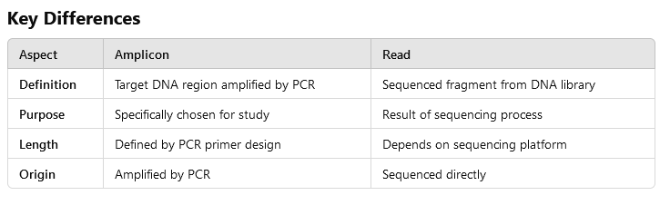

# read recruitment glossary
read here means short pieces of dna, and recruitment here means matching similar short pieces together. it’s like you have a job (a genome), and people (reads) get recruited for it. so, if we have a genome and want to see if it, as a whole or in parts, exists in our sample, we use this technique.  

please visit [this video](https://www.youtube.com/watch?v=MqD4aN1p1qA) to fully grasp the idea.

before doing the turorial, here is a glossary that you might find useful:

  
sequencing

  
  Determining the precise order of nucleotides in a DNA or RNA.
  - Sanger sequencing (first generation)
  - Next generation sequencing (NGS)
  - Third gen (Oxford Nanopore, PacBio SMRT)

  
  
reference sequence

  
  - a sequence that serves as the base for comparing and aligning other sequences.
  - anything that is longer than your shorts may serve as a reference.

  
metagenomes

  
  - metagenomes are complete or partial genomes that have been gathered from an enviroment (for example soil or water)
  - they then have been sequenced by a sequencing machine to be transferred into a computer.
  - the so-called shift from in vitro to in silico.

  
short reads

  
- dna sequences generated during sequencing, ranging from 50 to 300 base pairs.
- they are produced by technologies like illumina.
- shorts can be long: you can recruit long-reads with your ref sequence, too.

  
short reads generation

  
  1. **fragmentation**: using physical, enzymatic, chemical methods. 
  they produce fragments of varying size but within a specific range (200-500).
  2. **size selection**: using electrophoresis, purification.
  fragments within the desired size are enriched others are discarded.
  3. **adapter ligation**: short dna sequences (adapters) are added to the end of the fragments.
  for attaching fragments to the sequencing platform.
  4. **sequencing by synthesis**: illumina sequences fragments. 
  the length is defined by the number of cycles during the sequence.

  
contig

  - when sequencing generates **many reads that overlap**, it means that the sequencing machine produces multiple short fragments of DNA that represent the **same regions of the original DNA sequence**, often with overlapping sections. what does it mean?
  - it means that one part of the dna is being read several times by the machine and the parts that have been repeated with a high likelihood are the correct bases. these are accepted as shorts. then these shorts are put together to form a contig which is longer. you can have a ref for building a contig or not. software looks at the reads and finds when the end of one read matches the start of another and that is how it knows how to put the shorts in order.

  
amplicon

  - amplify: large, -on: used in genetics to denote a unit or region.
  - piece of dna that has been amplified (copied).
  - you can use pcr to copy those pieces.
  - are usually small, ranging from 100 to 500 base pairs

  
metagenomic

  Metagenomics is the study of the genetic material recovered directly from environmental samples, bypassing the need to isolate and culture individual organisms. 

  
what is the purpose of read recruitment purpose?

  - investigate one or more ref sequences in the context of one of more samples to which we have access through short reads.
  - your ref and short reads can be anything.
 

  
what can serve as a reference?

  - **complete genomes** (e.g., bacterial, viral, eukaryotic).
  - **draft genomes** or **contigs** (incomplete assemblies from sequencing projects).
  - **individual genes** or **regions of interest** (e.g., marker genes like 16S rRNA, functional genes.)
  - **Metagenome-assembled genome (MAGs)** from previous analyses.
  - even artificially constructed sequences or hypothetical references.
 

  
what can serve as short reads?

  **short reads are raw sequencing reads from your dataset.** (it means that we have extracted them and fragmented in vitro, then given that to a sequencing machine and now we have the sequences in silico and we can work on them.
  
  - **metagenomic datasets**, where sequences come from a mixed microbial community.
  - **transcriptomic datasets**, focusing on RNA sequences (e.g., for gene expression studies).
  - **amplicon sequencing** (e.g., 16S or ITS reads) for community profiling.
  - **whole-genome sequencing** (WGS) data for a specific organism.
  - even synthetic or simulated reads, depending on the purpose of the study.
  

  
 are amplicons connected or separated? 

  they can be connected or separated, depending on the context of the analysis.
  
  - connected: in metagenomics, they can overlap if they are multiple fragments.
  - separated: in pcr or sequencing and analysis.
  
  in anvio they are typically treated as separated unless you assemble them into contigs.
 

  
what is the difference: amplicons - reads?

  
  

 

  
 can you get amplicons from a read?

  We don’t usually produce amplicons from reads because reads are random fragments of DNA generated during sequencing. Amplicons, on the other hand, are specific DNA regions amplified during a PCR-based process, targeting a particular part of the genome (e.g., the 16S rRNA gene). Reads can, however, be used to reconstruct amplicons when they originate from sequencing targeted amplicons.
 

