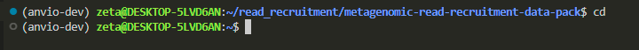
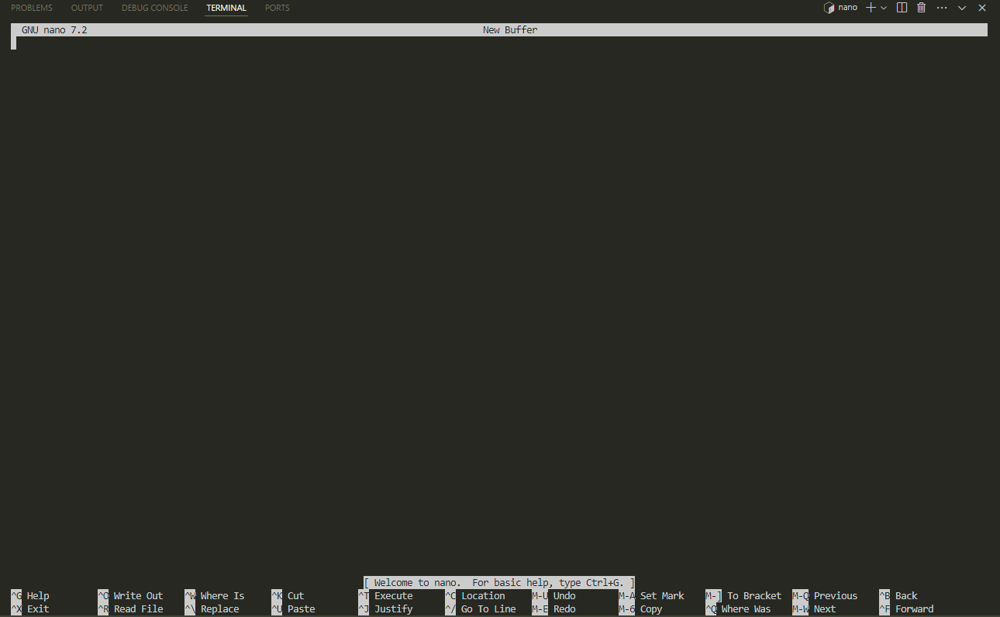
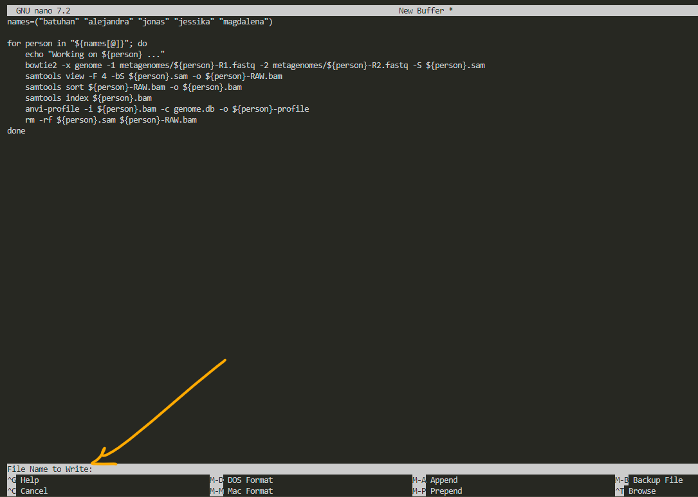
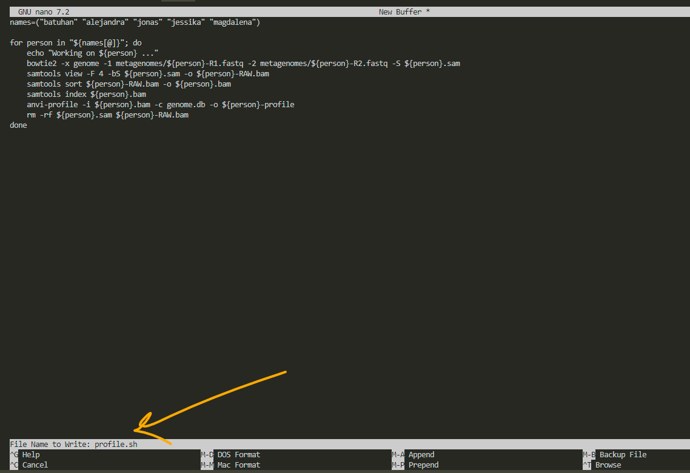
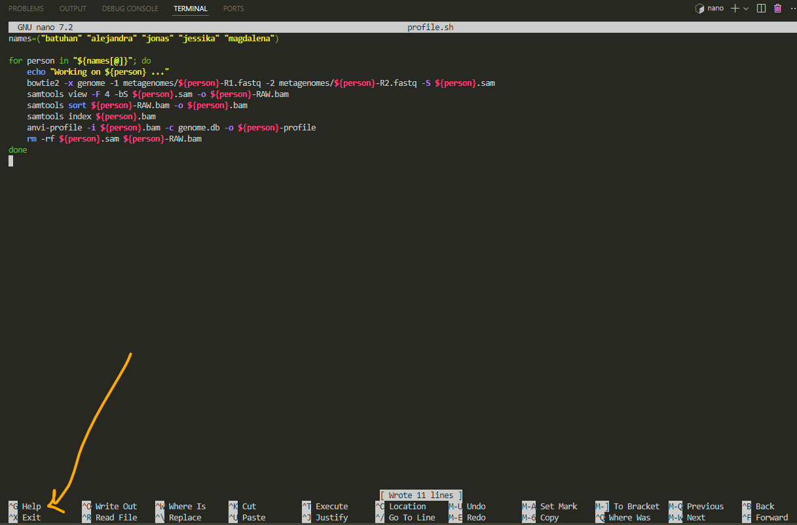
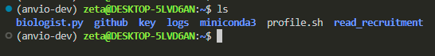

# what is bash and script?

**Bash** is the language we use to communicate with the terminal (the black tab where we type commands) and **script** is just a fancy way of saying a file with some lines of commands written in it.

**how to save and run a script in bash?**  

or take a step back: why would we even want to do that?  
sometimes we need to run the same commands regularly. instead of retyping or copy-pasting them every time, we can save those commands in a file and simply call that file whenever we need it.

for example in the [read recruitment exercise](https://zetazee.github.io/anvio/read_recruitment.html) we have a script for looping through the metagenomes for generating a `profile.db` file for each and we can save that in a file for later use.

so let's use that example and learn how to save and run it.

first, move to your desired location, like your home directory.
to do that, type `cd`, and you’ll be out of the current directory. when we don’t specify a directory, it defaults to `home`.  

```bash
cd
```



now we use a tool named `nano`. we call its name, and it appears. (just type `nano` and press `enter`):  

```bash
nano
```

nano is like notepad or note app in our phone. it can save some text in it.




then i copy paste this:

```bash
names=("batuhan" "alejandra" "jonas" "jessika" "magdalena")

for person in "${names[@]}"; do
    echo "Working on ${person} ..."
    bowtie2 -x genome -1 metagenomes/${person}-R1.fastq -2 metagenomes/${person}-R2.fastq -S ${person}.sam
    samtools view -F 4 -bS ${person}.sam -o ${person}-RAW.bam
    samtools sort ${person}-RAW.bam -o ${person}.bam
    samtools index ${person}.bam
    anvi-profile -i ${person}.bam -c genome.db -o ${person}-profile
    rm -rf ${person}.sam ${person}-RAW.bam
done
```

here we have added a list called “names” and we can change it whenever we want and it makes the script a little bit more general to use.

after pasting it to the nano, we press ctrl O and it asks us to choose a name for our file:



i name it `profile.sh` to remember that this script creates profiles for visualization. always remember to add `.sh` as the extension to whatever name you choose. after that, press `enter`. 



for exit, press ctrl X:



now we have the script and we can use it for any other metagenomic data profiling:



for running a `.sh` file we need to ask bash to run it for us:

```bash
bash profile.sh
```


if we need to run it for other data than these metagenomes, we simply open the script by typing `nano profile.sh`, edit the list (names), and then run it.

also you'll see that nano doesn't like mouse. you need to move around by arrows.
